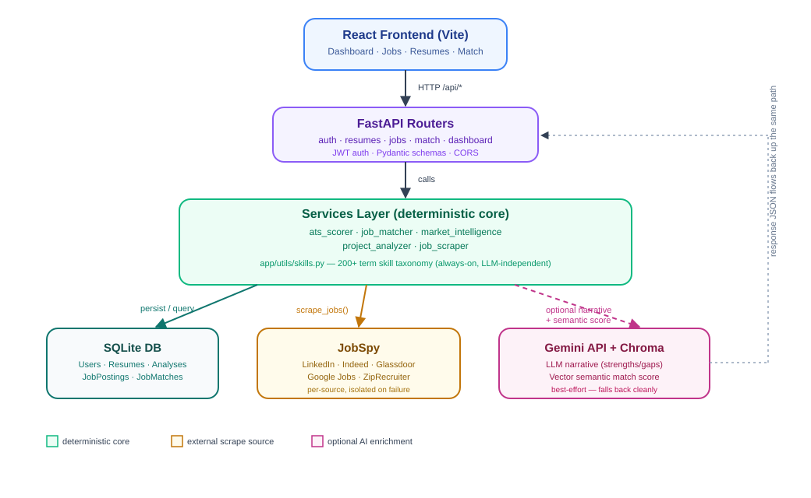

# 🧭 CareerLens AI

### Explainable job search & resume intelligence

CareerLens AI scores your resume against real job postings, discovers matching roles across multiple platforms, and shows exactly which skills are closing — or blocking — the gap.

### ✨ Features

- 🎯 Explainable ATS scoring
- 🔍 Multi-platform job discovery
- 🧩 Explainable job matching
- 🔁 Project repetition detection
- 📊 Market intelligence dashboard
- 🔐 JWT authentication

 

---

 

## 🏗️ Architecture

 

*A request flows from the React frontend through FastAPI routers into the scoring core, with results persisted to SQLite and optionally enriched with JobSpy, Gemini, and Chroma.*

 
